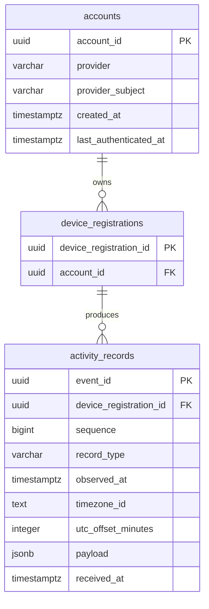

# 활동 저장 ERD

> 상태: 목표 설계, 구현 전
> 범위: 현재 계정 모델과 초기 활동 원본 저장 모델

이 문서는 초기 활동 수집에 필요한 최소 물리 모델을 정의한다. 아래 ERD에 포함한
테이블 가운데 현재 구현된 것은 `accounts`뿐이다. 인증용 `native_auth_codes`는 이미
존재하지만 활동 저장 범위가 아니므로 표시하지 않는다. `device_registrations`와
`activity_records`는 아직 SQLAlchemy 모델이나 migration으로 구현되지 않았다.

## `accounts`

기존 SQLAlchemy 모델을 그대로 표시한다. 이번 활동 저장 설계에서는 컬럼을
추가하거나 변경하지 않는다.

| 컬럼 | 타입 | 제약 | 의미 |
| --- | --- | --- | --- |
| `account_id` | UUID | PK | 계정 식별자. |
| `provider` | VARCHAR(32) | NOT NULL | 계정 공급자. 현재 `KAKAO`만 사용한다. |
| `provider_subject` | VARCHAR(255) | NOT NULL | 공급자가 부여한 사용자 식별자. |
| `created_at` | TIMESTAMPTZ | NOT NULL, server default | 계정 생성 시각. |
| `last_authenticated_at` | TIMESTAMPTZ | NOT NULL, server default | 마지막 인증 시각. |

추가 제약:

- `UNIQUE(provider, provider_subject)`

## `device_registrations`

한 계정에 귀속된 앱 설치 등록이다. 한 계정은 여러 등록 이력을 가질 수 있지만
동시에 하나만 접속하도록 강제하는 인증 상태는 이 테이블에 저장하지 않는다.

| 컬럼 | 타입 | 제약 | 의미 |
| --- | --- | --- | --- |
| `device_registration_id` | UUID | PK | 서버가 발급한 앱 설치 등록 식별자. |
| `account_id` | UUID | NOT NULL, FK | 등록을 소유한 계정. |

외래 키와 인덱스:

- `account_id -> accounts.account_id ON DELETE CASCADE`
- `INDEX(account_id)`

기기 이름, 플랫폼, 대표 여부, 우선순위, 활성 여부, 폐기 시각은 초기 저장에 필요하지
않으므로 두지 않는다.

## `activity_records`

개인정보 필터 후 활동 레코드의 source of truth다. 활동 구간이나 수집 공백을 저장하지
않으며 조회 시 이 테이블에서 계산한다.

| 컬럼 | 타입 | 제약 | 의미 |
| --- | --- | --- | --- |
| `event_id` | UUID | PK | 클라이언트가 생성한 레코드 식별자이자 단건 재시도 멱등성 키. |
| `device_registration_id` | UUID | NOT NULL, FK | 레코드를 생성한 기기 등록. |
| `sequence` | BIGINT | NOT NULL | 같은 기기 등록 안의 증가 순번. |
| `record_type` | VARCHAR(32) | NOT NULL, CHECK | 레코드 종류. |
| `observed_at` | TIMESTAMPTZ | NOT NULL | 클라이언트가 관찰에 부여한 UTC 시각. |
| `timezone_id` | TEXT | NOT NULL | 관찰 당시 IANA 시간대 식별자. |
| `utc_offset_minutes` | INTEGER | NOT NULL | 관찰 당시 UTC와 현지 시간의 차이(분). |
| `payload` | JSONB | NOT NULL | 레코드 종류별 본문. |
| `received_at` | TIMESTAMPTZ | NOT NULL, server default | 서버가 레코드를 수신해 저장한 시각. |

제약:

- `UNIQUE(device_registration_id, sequence)`
- `CHECK(sequence >= 0)`
- `CHECK(record_type IN ('activity_observation', 'collection_state_changed'))`
- `device_registration_id -> device_registrations.device_registration_id ON DELETE CASCADE`

인덱스:

- PK와 UNIQUE 제약이 `event_id`, `(device_registration_id, sequence)` 조회를 지원한다.
- 기기별 기간 조회를 위해 `INDEX(device_registration_id, observed_at)`를 둔다.

### JSONB payload

`payload`에는 이미 Pydantic 검증을 통과한 종류별 본문만 저장한다.

| `record_type` | payload 구조 |
| --- | --- |
| `activity_observation` | `{ "context": DetailedActivityContext \| OpaqueActivityContext }` |
| `collection_state_changed` | `{ "state": "active" \| "suspended", "reason": string }` |

공통 envelope를 JSONB에 다시 복제하지 않는다. 같은 `event_id`가 다시 들어오면
서버가 생성한 `received_at`을 제외한 일반 컬럼과 payload를 직접 비교하며,
`event_hash`는 두지 않는다.

## 저장하지 않는 모델

초기 ERD에는 다음 테이블과 컬럼을 포함하지 않는다.

- `activity_ingest_batches`, `batch_id`, `request_hash`
- `activity_collection_streams`, `collection_stream_id`, stream watermark
- `activity_timeline_segments`와 다른 timeline projection
- `clock_epoch_id`, `monotonic_ns`
- `event_hash`
- 대표 기기, 기기 우선순위, 활동 자동 병합 상태
- AI 해석과 사용자 확정 의미

## 조회 경계

계정 타임라인은 `device_registrations.account_id`로 소유권을 제한한 뒤 조회 기간의
`activity_records`를 읽어 계산한다. 레코드의 `device_registration_id`는 결과에
남겨 기기 출처를 잃지 않는다.

초기 제품은 계정마다 동시에 하나의 기기만 접속한다고 가정한다. 이 가정은 현재
ERD만으로 강제되지 않으며, 새 로그인 시 기존 JWT를 즉시 무효화하는 인증 TODO가
완료되어야 서버 불변조건이 된다.
