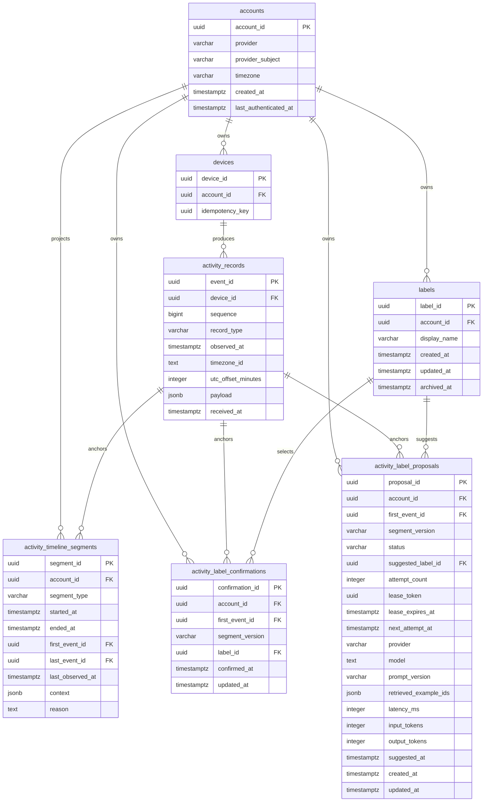

# 활동 저장 ERD

> 상태: 활동 원본, 관찰 타임라인 projection, 라벨 확정·제안 저장 구현
> 범위: 계정 시간대, 활동 원본, 저장형 관찰 타임라인, 라벨 상태

> 계약: ADR 0004와 `docs/PRD_OBSERVATION_TIMELINE.md`를 따른다.

인증용 `native_auth_codes`는 활동 저장 범위가 아니므로 표시하지 않는다.
아래 테이블은 SQLAlchemy 모델과 migration으로 구현되어 있다. 초기 타임라인
원본 데이터가 없으므로 projection의 기존 기록 backfill은 수행하지 않는다.

## `accounts`

날짜 조회는 계정의 IANA 시간대로 현지 날짜 경계를 계산한다. 개발 단계의 명시적
예외로 첫 계정 생성 migration에 시간대 컬럼을 추가했다.

| 컬럼 | 타입 | 제약 | 의미 |
| --- | --- | --- | --- |
| `account_id` | UUID | PK | 계정 식별자. |
| `provider` | VARCHAR(32) | NOT NULL | 계정 공급자. 현재 `KAKAO`만 사용한다. |
| `provider_subject` | VARCHAR(255) | NOT NULL | 공급자가 부여한 사용자 식별자. |
| `timezone` | VARCHAR(255) | NOT NULL, `Asia/Seoul` DB default | 날짜 조회의 계정 시간대. Python `Timezone` enum으로 다루며 DB CHECK는 없다. |
| `created_at` | TIMESTAMPTZ | NOT NULL, server default | 계정 생성 시각. |
| `last_authenticated_at` | TIMESTAMPTZ | NOT NULL, server default | 마지막 인증 시각. |

추가 제약:

- `UNIQUE(provider, provider_subject)`

## `labels`

계정별로 활동의 의미를 나타내는 라벨 카탈로그다. 기본 라벨 다섯 개는 계정 생성
시점의 초기 seed일 뿐이며, 이후에는 사용자 정의 라벨과 동일하게 취급한다. 별도의
기본 라벨 식별자는 저장하지 않는다.

| 컬럼 | 타입 | 제약 | 의미 |
| --- | --- | --- | --- |
| `label_id` | UUID | PK | 라벨의 안정적인 식별자. |
| `account_id` | UUID | NOT NULL, FK | 라벨을 소유한 계정. |
| `display_name` | VARCHAR(255) | NOT NULL | 사용자에게 표시하는 라벨 이름. |
| `created_at` | TIMESTAMPTZ | NOT NULL, server default | 라벨 생성 시각. |
| `updated_at` | TIMESTAMPTZ | NOT NULL, server default | 이름 변경·보관·복원 등 마지막 변경 시각. |
| `archived_at` | TIMESTAMPTZ | nullable | 보관 시각. NULL이면 보관하지 않은 상태. |

추가 제약:

- `UNIQUE(account_id, display_name)` — 활성·보관 라벨 전체에 적용
- `account_id -> accounts.account_id ON DELETE CASCADE`

마이그레이션은 기존 계정마다 `코딩`, `학습`, `소통`, `쇼핑`, `여가`를 한 번씩
삽입한다. `(account_id, display_name)` 충돌 시 기존 행의 이름·상태·시각을 그대로
보존한다. 보관 라벨은 이력에는 남지만 새 활동의 제안·선택 후보에서는 제외한다.

## `devices`

한 계정에 귀속되어 서버에 등록된 앱 설치다. 한 계정은 여러 Device를 가질 수 있지만
동시에 하나만 접속하도록 강제하는 인증 상태는 이 테이블에 저장하지 않는다.

| 컬럼 | 타입 | 제약 | 의미 |
| --- | --- | --- | --- |
| `device_id` | UUID | PK | 서버가 발급한 Device 식별자. |
| `account_id` | UUID | NOT NULL, FK | Device를 소유한 계정. |
| `idempotency_key` | UUID | NOT NULL | 클라이언트가 하나의 등록 시도에 부여한 멱등 키. |

외래 키와 인덱스:

- `account_id -> accounts.account_id ON DELETE CASCADE`
- `INDEX(account_id)`
- `UNIQUE(account_id, idempotency_key)`

`POST /api/v1/devices`는 서버가 `device_id`를 발급한다.
클라이언트는 요청 전에 UUID `Idempotency-Key`를 저장하고, 응답을 받기 전 재시도에는
같은 값을 사용한다. 같은 계정과 같은 키에는 최초 발급한 식별자를 반환한다.

기기 이름, 플랫폼, 대표 여부, 우선순위, 활성 여부, 폐기 시각은 초기 저장에 필요하지
않으므로 두지 않는다.

## `activity_records`

개인정보 필터 후 활동 레코드의 source of truth다. 원본 삽입과 같은 트랜잭션에서
관찰 구간 projection을 갱신하지만, GET이 원본에서 다시 grouping하지 않는다.

| 컬럼 | 타입 | 제약 | 의미 |
| --- | --- | --- | --- |
| `event_id` | UUID | PK | 클라이언트가 생성한 레코드 식별자이자 단건 재시도 멱등성 키. |
| `device_id` | UUID | NOT NULL, FK | 레코드를 생성한 Device. |
| `sequence` | BIGINT | NOT NULL | 같은 Device 안의 증가 순번. |
| `record_type` | VARCHAR(32) | NOT NULL, CHECK | 레코드 종류. |
| `observed_at` | TIMESTAMPTZ | NOT NULL | 클라이언트가 관찰에 부여한 UTC 시각. |
| `timezone_id` | TEXT | NOT NULL | 관찰 당시 시간대 식별자. Python `Timezone` enum으로 다루며 DB CHECK는 없다. |
| `utc_offset_minutes` | INTEGER | NOT NULL | 관찰 당시 UTC와 현지 시간의 차이(분). |
| `payload` | JSONB | NOT NULL | 레코드 종류별 본문. |
| `received_at` | TIMESTAMPTZ | NOT NULL, server default | 서버가 레코드를 수신해 저장한 시각. |

제약:

- `UNIQUE(device_id, sequence)`
- `CHECK(sequence >= 0)`
- `CHECK(record_type IN ('activity_observation', 'collection_state_changed'))`
- `device_id -> devices.device_id ON DELETE CASCADE`

인덱스:

- PK와 UNIQUE 제약이 `event_id`, `(device_id, sequence)` 조회를 지원한다.
- Device별 기간 조회를 위해 `INDEX(device_id, observed_at)`를 둔다.

### JSONB payload

`payload`에는 이미 Pydantic 검증을 통과한 종류별 본문만 저장한다.

| `record_type` | payload 구조 |
| --- | --- |
| `activity_observation` | `{ "context": DetailedActivityContext \| OpaqueActivityContext }` |
| `collection_state_changed` | `{ "state": "active" \| "suspended", "reason": string }` |

공통 envelope를 JSONB에 다시 복제하지 않는다. 같은 `event_id`가 다시 들어오면
서버가 생성한 `received_at`을 제외한 일반 컬럼과 payload를 직접 비교하며,
`event_hash`는 두지 않는다.

## `activity_timeline_segments`

계정 전체의 모든 Device에서 관찰한 동일 문맥의 활동 구간과 명시적 수집 공백을
함께 보관하는 재구축 가능한 읽기 모델이다. Device 출처는 grouping·응답 경계가
아니다. `segment_id`는 단순 연장·종료 때 유지되지만 영구 도메인 ID는 아니다.

| 컬럼 | 타입 | 제약 | 의미 |
| --- | --- | --- | --- |
| `segment_id` | UUIDv7 | PK | 저장된 구간의 projection 식별자. |
| `account_id` | UUID | NOT NULL, FK | 구간을 소유한 계정. |
| `segment_type` | VARCHAR(32) | NOT NULL, CHECK | `activity` 또는 `capture_gap`. |
| `started_at` | TIMESTAMPTZ | NOT NULL | 첫 원본 이벤트의 관찰 시각. |
| `ended_at` | TIMESTAMPTZ | nullable, CHECK | 실제 관찰 또는 침묵에 근거한 종료 시각. 0초도 허용한다. |
| `first_event_id` | UUID | NOT NULL, FK | 구간을 시작한 원본 이벤트. |
| `last_event_id` | UUID | activity에 필수, gap에서는 NULL | 마지막 동일 문맥 활동 관찰 이벤트. |
| `last_observed_at` | TIMESTAMPTZ | activity에 필수, gap에서는 NULL | 활동의 마지막 실제 관찰 시각. |
| `context` | JSONB | activity에 필수, gap에서는 NULL | 개인정보 필터를 마친 원본 전체 문맥. |
| `reason` | TEXT | gap에 필수, activity에서는 NULL | 첫 `suspended`의 이유. |

`account_id`는 계정 삭제에 cascade한다. 두 이벤트 FK는 개별 원본 삭제 전에
projection을 수정하도록 deferred `NO ACTION`이다. 종류별 필수·NULL, 종료 시각
순서, 마지막 관찰 시각 순서는 DB CHECK로 검증한다. 계정과 시작 시각 인덱스가
날짜 조회와 재계산 경계를 지원한다.

## 저장하지 않는 모델

초기 ERD에는 다음 테이블과 컬럼을 포함하지 않는다.

- `activity_ingest_batches`, `batch_id`, `request_hash`
- `activity_collection_streams`, `collection_stream_id`, stream watermark
- 별도 활동 구간·수집 공백 테이블, projection version/state table
- `clock_epoch_id`, `monotonic_ns`
- `event_hash`
- 대표 기기, 기기 우선순위, 활동 자동 병합 상태
- 라벨 타임라인 묶음·집계와 pgvector 확정 사례 검색

## `activity_label_confirmations`

사용자가 하나의 닫힌 상세 관찰 구간에 선택한 활성 라벨 또는 미분류를 저장하는
현재 확정 상태다. `segment_id`는 projection 재구축으로 바뀔 수 있으므로 저장하지
않고, 구간을 시작한 원본 이벤트와 관찰 결과의 불투명 `segment_version`을 anchor로
사용한다. 현재 구간의 version이 저장값과 다르면 확정은 더 이상 유효하지 않고
검토 대기로 표시한다.

| 컬럼 | 타입 | 제약 | 의미 |
| --- | --- | --- | --- |
| `confirmation_id` | UUIDv7 | PK | 확정 저장 행 식별자. |
| `account_id` | UUID | NOT NULL, FK | 확정 소유 계정. 계정 삭제 시 cascade한다. |
| `first_event_id` | UUID | NOT NULL, FK, account별 unique | 확정 당시 구간을 시작한 원본 이벤트. |
| `segment_version` | VARCHAR(64) | NOT NULL | 첫·마지막 이벤트, 시간 경계, 상세 문맥의 SHA-256 version. |
| `label_id` | UUID | nullable, FK | 활성 라벨 식별자. NULL이면 명시적 미분류. |
| `confirmed_at` | TIMESTAMPTZ | NOT NULL | 현재 version을 최초 확정한 시각. |
| `updated_at` | TIMESTAMPTZ | NOT NULL | 마지막 정정 시각. |

같은 계정과 anchor에는 최신 확정 하나만 남긴다. 원본 이벤트가 삭제되면 관련
확정도 cascade하며, 라벨 삭제는 기존 확정 보존을 위해 허용하지 않는다.

## `activity_label_proposals`

닫힌 상세 구간의 AI 제안과 작업자 처리 상태를 확정값과 별도로 저장한다. 같은
계정·원본 시작 이벤트·`segment_version`에는 제안 행이 하나이며, 새 확정 이력만으로
`ready` 제안을 다시 만들지 않는다. 관찰 projection이 바뀌면 이전 행을 보존하고
현재 version의 제안만 공개한다.

`suggested_label_id`가 NULL인 `ready` 행은 미분류 제안이다. `processing`에는
임대 토큰과 만료 시각이 있고, 실패 시 재시도 시각과 시도 횟수를 보존한다. 제안
라벨 FK는 `NO ACTION`이므로 기존 제안이 참조하는 라벨은 물리 삭제할 수 없다.
계정이나 원본 이벤트가 삭제되면 관련 제안은 cascade한다. 제공자·모델·프롬프트
버전·참고 확정 사례·지연시간·토큰 수는 제안 생성 근거를 추적하는 내부 정보다.

## 조회 경계

계정 타임라인 GET은 계정 소유의 `activity_timeline_segments`를 날짜와 겹침
조건으로 선택한다. 구간 순서 동률은 `first_event_id`가 가리키는 원본의
`received_at`, `event_id`로 정한다. 원본이나 Device 식별자는 응답에 노출하지
않고, 날짜 경계에서 구간을 자르지 않는다.

초기 제품은 계정마다 동시에 하나의 기기만 접속한다고 가정한다. 이 가정은 현재
ERD만으로 강제되지 않으며, 새 로그인 시 기존 JWT를 즉시 무효화하는 인증 TODO가
완료되어야 서버 불변조건이 된다.
